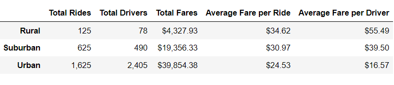
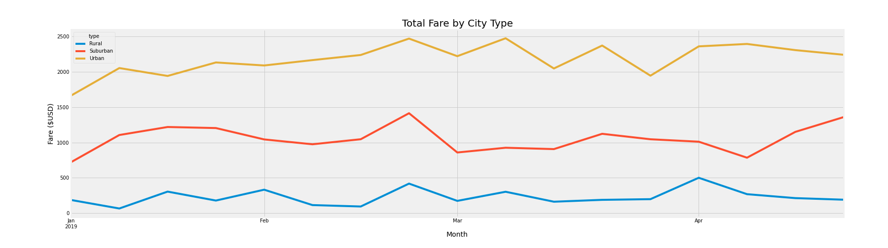

# ***PyBer Analysis***

## **Overview of Analysis**
------
The purpose of this analysis was to examine the data into a specific time frame and to chart it on a multiple-line graph. The data collected for this included the time frame of January-April (by weeks), the city type, and the sum of all fares within that time frame. There was also information gathered on the total drivers, total rides, total fares, average fare per ride, and average fare per driver for the entire data set. 

## **Results**
------
Please observe the following: 

The table above draws the following conclusions: 

      -Urban cities have more total rides but make less fares on average per ride and per driver.
      -Rural cities have fewer total rides but make more fares on average per ride and per driver.
      -Suburban cities fall in between urban and rural results. 

Additionally, please observe the following analysis: 

Here our analysis shows the variation of fares for the months of January through April. Here we can visualize the different values among the city types. 

## **Summary**

There are three plausible conclusions to be drawn from the following analysis:

   1.  PyBer should keep the number of drivers in rural areas low and the number of drivers in urban areas high. Suburban areas should have the number of drivers somewhere in between rural and urban areas. Maintaining this would maximize profits based on current trends. 

   2.  The multiple-line graph tells us that there is room for fluctuation in the number of drivers per city type for the months of January through April. Looking at the graph, one can observe that the beginning of January and the beginning of February are slow business periods for all city types. The end of February, March, and the beginning of April all saw a decrease in suburban areas, while increasing significantly for urban areas. This is possibly due to spring break vacations and PyBer would need to focus on urban areas for profits during this time. Alternatively, suburban areas saw some increase during the end of April, possibly signifying suburban dweller's return from spring vacations during that time. PyBer would need to send more drivers to suburban areas during that time. 

   3.  Rural areas remained somewhat stagnant throughout this time period, apart from the end of February and the beginning pf April. PyBer would just need to remain consistent with the number of drivers there to maximize profits.

